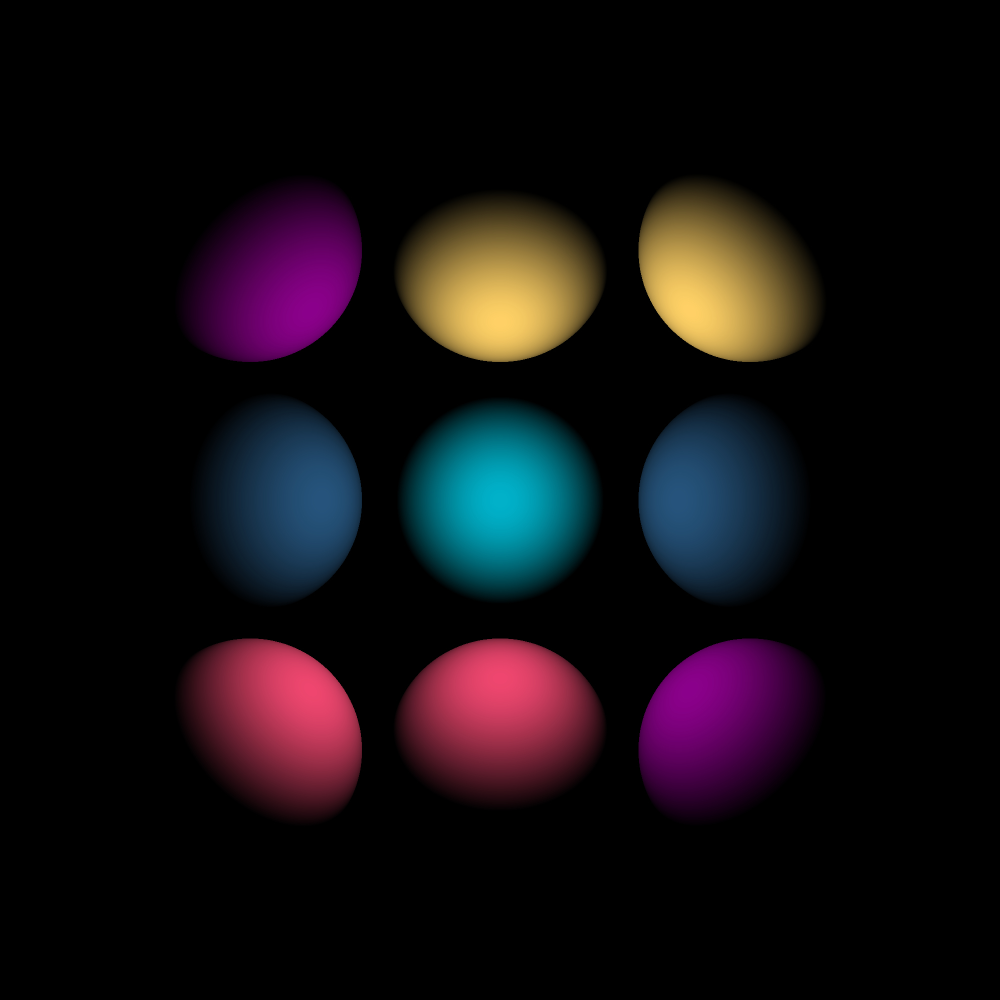
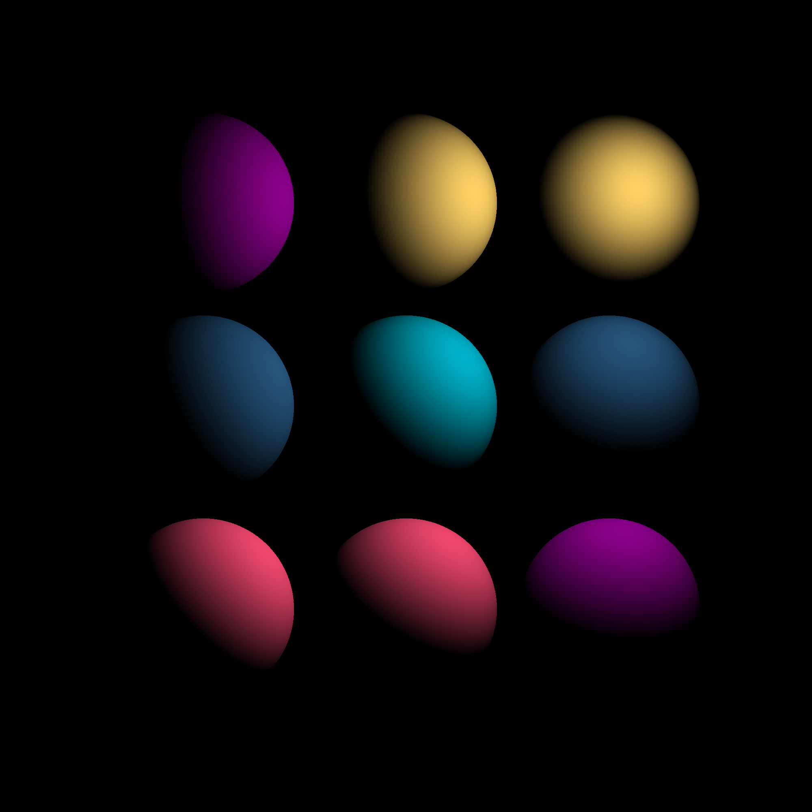

RayTracer
================
A basic CPU RayTracer written in modern C++.

About
------------------
Author: `Daniel Sebastian Iliescu, http://dansil.net`  
License: `MIT License (MIT), http://opensource.org/licenses/MIT`  

Features
------------------
<ul>
  <li>Basic multithreading support with OpenMP.</li>
  <li>Basic color mapping given object intrinsic color.</li>
  <li>Supports multiple objects and multiple point light sources.</li>
  <li>Uses a scene file (JSON format) to dynamically render elements at runtime.</li>
</ul>

Usage
------------------
	./RayTracer --scene path_to_scene.json
	./RayTracer --help

  The image will be trace unto a fullscreen window. Pressing any key will close the window.

Requirements
------------------
C++17 conforming compiler.

Dependencies
------------------
<table>
  <tr>
    <th>Type</th>
    <th>Dependency</th>
  </tr>
  <tr>
    <td>Parallelization</td>
    <td>OpenMP</td>
  </tr>
  <tr>
    <td>Program Arguments</td>
    <td>Boost.Program_options</td>
  </tr>
  <tr>
    <td>Unit Testing</td>
    <td>Boost.Test</td>
  </tr>
  <tr>
    <td>Contiguously-allocated tensor (2D and 3D)</td>
    <td>Eigen</td>
  </tr>
  <tr>
    <td>Scene (JSON) Parsing</td>
    <td>Boost.PropertyTree</td>
  </tr>
  <tr>
    <td>Window</td>
    <td>SFML</td>
  </tr>
</table>

Screenshot
================
Output image showing how light is traced and intersected by spheres of different colors at different locations (radially outwards).



Output image showing similar setup with point light in top right corner.



Limitations/ToDo
------------------
<ul>
  <li>Multiple object intersections is not supported. The RayTracer will simply render the first object intersected, even if there is an object behind it. This is a direct consequence of the RayTracer not being recursive. This should change in the near future.
  <li>Add material support in addition to object color. Make color derived from material rather than object and specify material color reflectance efficiency.</li>
  <li>Refactor the OpenMP usage with the C++17 execution policies (http://en.cppreference.com/w/cpp/algorithm/execution_policy_tag_t) when they become available.</li>
</ul>

Technical Pseucode (Basic)
------------------
```
for every row
{
  for every column
  {
    for every object in the scene
    {
      Compute the intersection of the ray for every object in the scene.

      Compute the intersection point of the ray with the object. Color is mapped for the current pixel only if the ray intersects the object.
      Otherwise, the pixel is rendered black.

      for every intersection of the ray with the object
      {
        Calculate the illumination unto an object given every possible illumination in the scene.

        for every illuminations in the scene
        {
          Compute the normal (towards light) at the intersection point, which is defined as follow
          
          Intersection Normal (Vector) = Light (Point) - Intersection (Point)
          Point - Point -> Vector

          Compute the normal (vector) of the object given an intersection point.
          The normal of the object returned is a unit vector for use in the dot product with the normal intersection towards the point light.

          Normalize the resulting vector. The normal intersection towards the point light also needs to be a unit vector for use in the dot product calculation.

          The value computed is that of the dot product between the normal of the object and the normal at the intersection point towards the point light.
					
          The projection of the intersection normal towards the object normal will yield greater values as both vectors become more similarly directed.
          As these vectors become less similarly directed, the dot product of these two vectors will yield a lower value.
          In other cases, the angle between both vectors will be greater than 90 degrees and lower than 270 degrees, placing them in opposite directions.
          This will yield a negative dot product due to the cosine of such an angle, which returns a negative value.
        }

        Given a container of illumination projections unto an object, we need to retrieve a single mapped value.
        We can simply accumulate all of the projection values for a given object intersection.
        The more positive projections unto an object intersection, the greater the reflected illuminance at that point.
        
        Negative projection values are not accumulated because it would lower the reflectance of an object at given intersection.
        One light source yielding a negative projection unto an intersection should not lower the overall reflectance because that same intersection could be projected by another light source.

        Color mapping is performed on the intensity of the projection computed.
        Color mapping returns a value linearly proportional to the intensity value.
        At peak intensity, the pixel reflects the object's maximal color value.
        This color value decreases (darkens) proportionally to the computed intensity.
        No color is mapped for negative intensity values, resulting in a black pixel.
      }
    }
  }
}
```